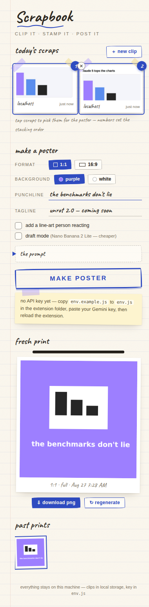

# Scrapbook

A personal Chrome extension (Manifest V3) for clipping things off the web and turning
them into share-ready AI posters for Instagram and X — in an established visual style.
Clip AI news, charts, and product screenshots; collect them in a paper-notebook side
panel; stamp them into a poster generated by Gemini's Nano Banana 2 image model.



## Install (load unpacked)

1. Copy `extension/env.example.js` to `extension/env.js` and paste your Gemini API key
   (get one at [aistudio.google.com/apikey](https://aistudio.google.com/apikey)).
   `env.js` is gitignored — the key never leaves your machine.
2. Open `chrome://extensions`, turn on **Developer mode** (top right).
3. Click **Load unpacked** and select the `extension/` folder.
4. Pin Scrapbook to the toolbar. Press **Cmd+Shift+S** (Mac) / **Ctrl+Shift+S** on any
   page, or click the toolbar icon, to clip your first region.

## How it works

**Capture (Milestone 1).** The shortcut or toolbar click injects a capture overlay into
the current tab: the page dims, you drag a dashed ink frame around the region you want.
On release the overlay removes itself, the service worker grabs the visible tab with
`chrome.tabs.captureVisibleTab`, crops your selection on an `OffscreenCanvas` (DPR- and
zoom-aware), and the clip drops into the scrapbook tray in the side panel — thumbnail,
source domain, timestamp. Collect up to 5 clips across different tabs; the tray persists
in `chrome.storage.local`.

**Posters (Milestone 2).** In the side panel: tap scraps to pick them (numbers set the
stacking order), choose 1:1 or 16:9, purple or white background, type your punchline,
tweak the tagline, optionally add a line-art person or switch to draft mode. The
extension composes the house-style prompt (inspect and hand-edit it under "the prompt"),
then sends your actual clips as multi-image input to the Gemini Interactions API:

- `gemini-3.1-flash-image` — Nano Banana 2 (default, 2K output)
- `gemini-3.1-flash-lite-image` — Nano Banana 2 Lite (draft mode, 1K output)

The result slides in like a photo print, with Download PNG and Regenerate. The last 5
posters are kept in a history strip.

## Permissions

`activeTab`, `scripting`, `storage`, `sidePanel`, plus a single host permission for
`generativelanguage.googleapis.com`. Nothing broader — capture works through the
`activeTab` grant your click/shortcut provides, so the extension has no standing access
to any site.

## Layout

```
extension/
  manifest.json          MV3 manifest
  background.js          service worker: capture, crop, storage, Gemini calls
  env.example.js         copy to env.js and add your API key (gitignored)
  content/               region-capture overlay (injected on demand)
  sidepanel/             the scrapbook: tray, poster studio, history
  fonts/                 bundled Caveat (handwriting display face)
  icons/                 toolbar + store icons
```
